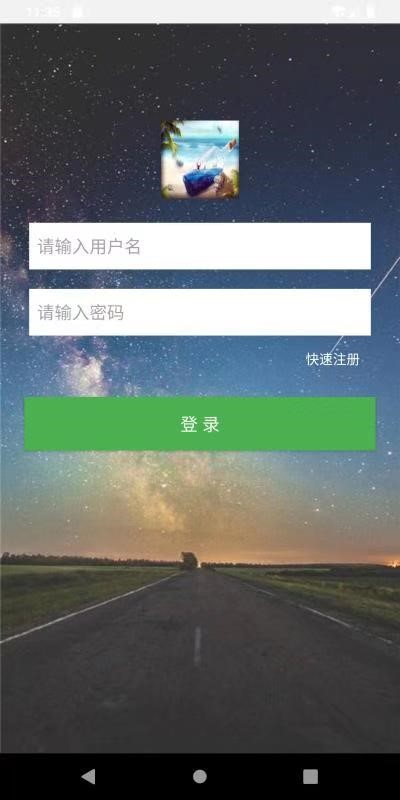
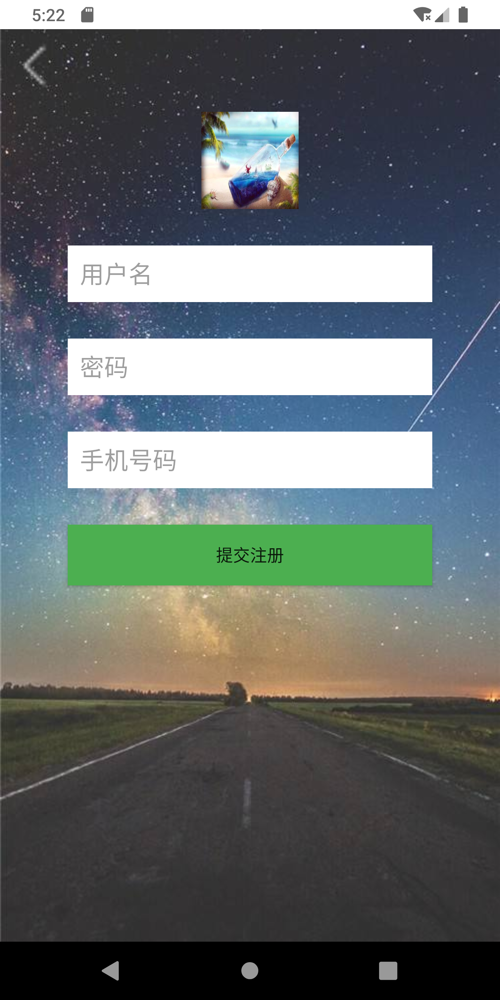
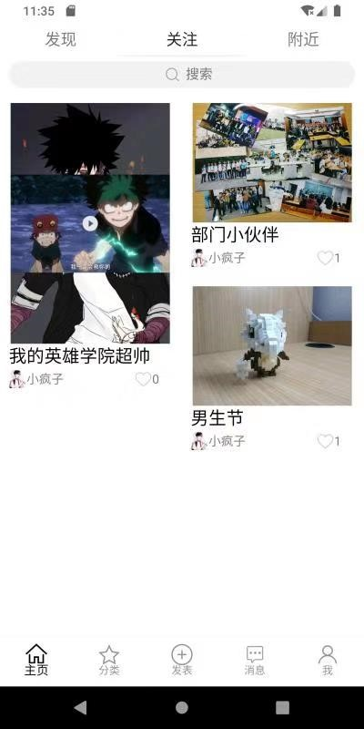
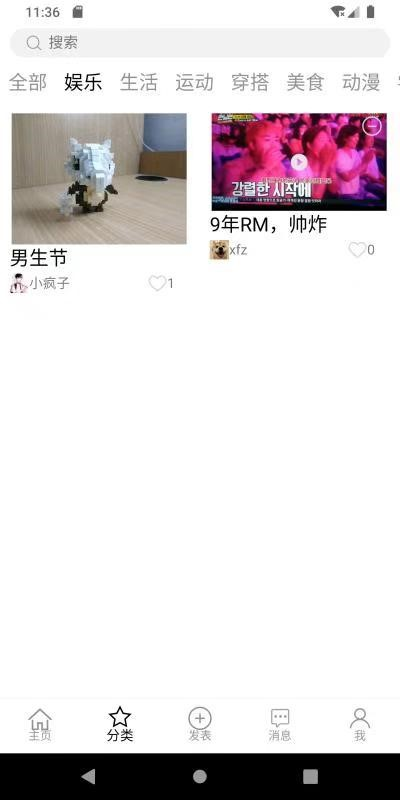
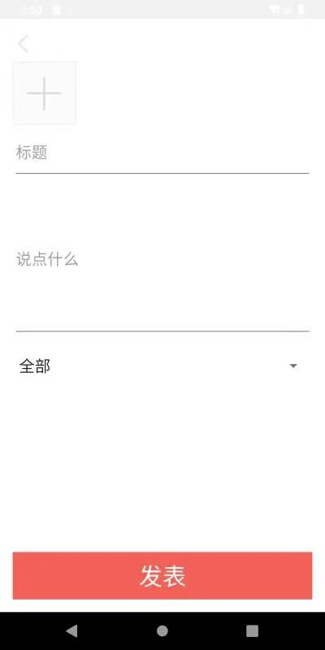
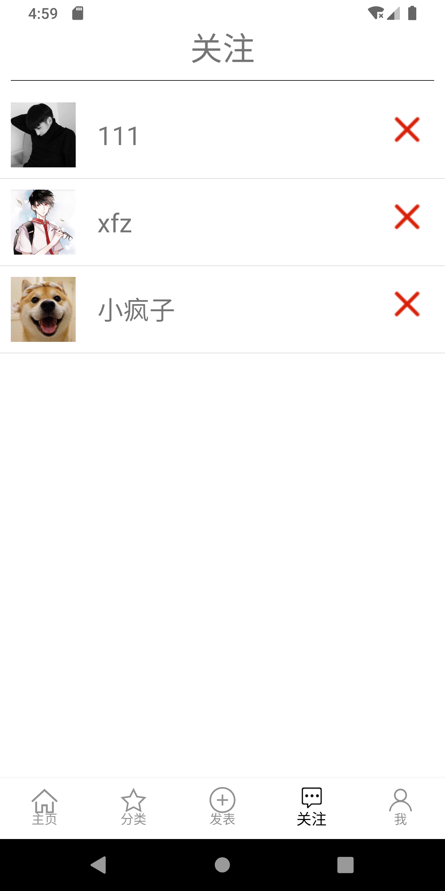
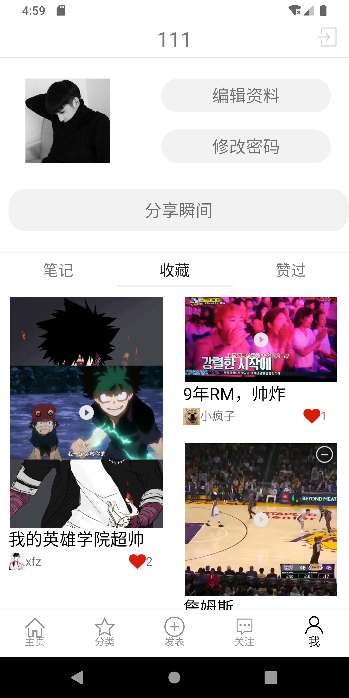
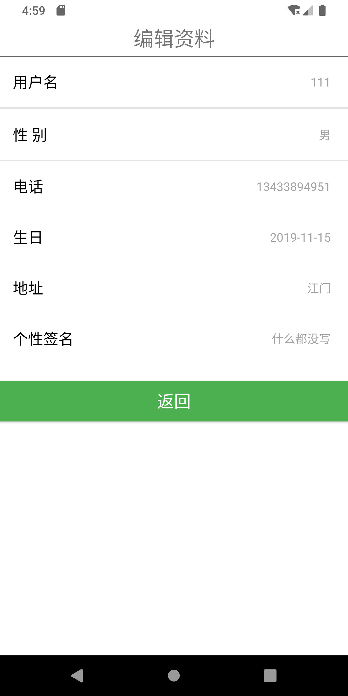
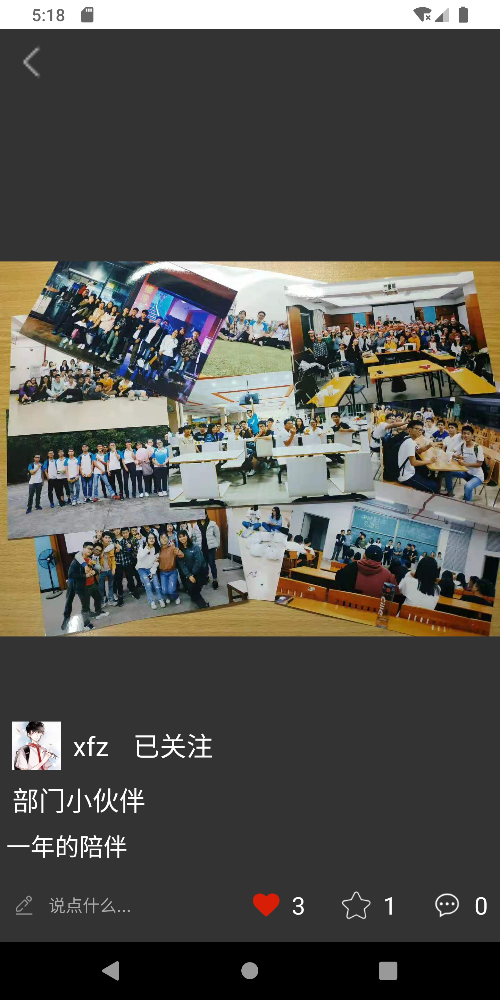
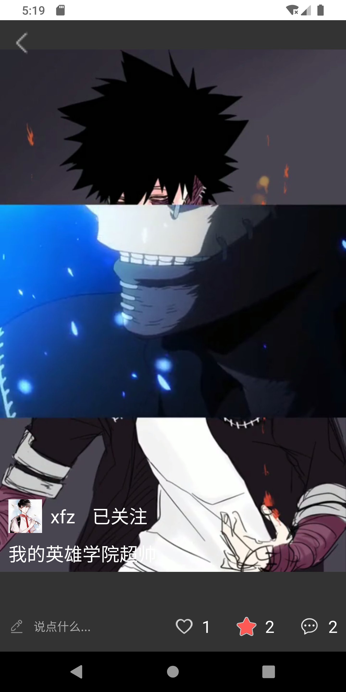

# 仿小红书APP

## 1. 简介

小红书APP是一个年轻生活方式分享平台。其中90后和95后是其中最活跃的用户群体，在这里发现美好、真实、多元的世界，找到有意思的明星达人,与他们一起共同标记自己生活的点滴。用户每日分享海量服饰搭配、美妆教程、旅游攻略、美食测评，用户通过短视频、图文等形式标记生活点滴，让用户轻松升级潮流生活老司机。

## 2. 开发平台

Android studio，MySQL。

## 3. 运行环境

操作系统：Windows 10

数 据 库：MySQL

## 4.小组分工：

本小组按功能模块进行分工，每个人负责俩个子功能。此外还有各自所需的负责的个人任务。

* 李记烽（本人）：主页模块＋分类模块＋项目整合

* 李康远：登录注册模块＋发表模块＋数据库搭建与连接

* 罗华娟：个人模块＋关注模块＋文档的编辑与整合

## 5.效果截图

